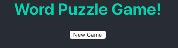
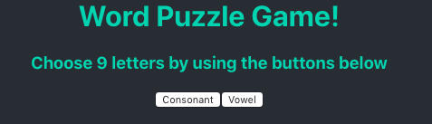
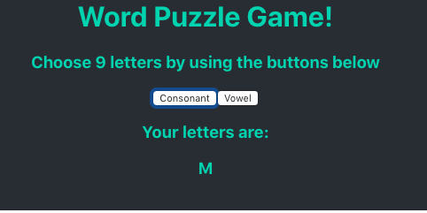
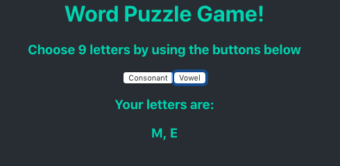

# Word Puzzle Game
> A react app that produces a random word puzzle to solve, with answers compared to the OED API

## Project Approach

This project is a continuation of my [Javascript Countdown](https://github.com/breycarr/countdown/tree/master/JavaScript) project. I made a React App using the class I wrote for making a conundrum and the scoring function.

* the ECMASCript 5 Javascript was updated to ES6 (ECMAScript 2015)
* Jest replaced Jasmine as the testing environment

This project was bootstrapped with [Create React App](https://github.com/facebook/create-react-app).

## Installation

`git clone` this repository and navigate to the project directory.

Run `yarn install` to update the dependencies.

## Available Scripts

In the project directory, you can run:

### `npm start`

Runs the app in the development mode. Open [http://localhost:3000](http://localhost:3000) to view it in the browser.

### `npm test`

Launches the test runner [Jest](https://jestjs.io/) in the interactive watch mode. Unit tests for the logic are in `./src/__tests__`, feature tests are in `./cypress/integration`

## How to play
> The app uses the rules of the long-running British TV series Countdown (also known as 'Letters and Numbers', 'Numbers and Letters' and 'A Word or 2' in different parts of the world)

To start a new game, press the new game button

The player then chooses between two stacks of letter tiles, one containing consonants and the other vowels, which reveals the top tile from that stack and places it in the board. 

This is done nine times and the final grouping must contain at least three vowels and four consonants. The player must then form the longest single word they can, using the nine revealed letters; no letter may be used more often than it appears in the selection.

The player scores one point per letter for a valid word, or 18 points if they have used all nine.

Any word which appears in the Oxford Dictionary of English is valid, according to the Oxford Dictionaries API